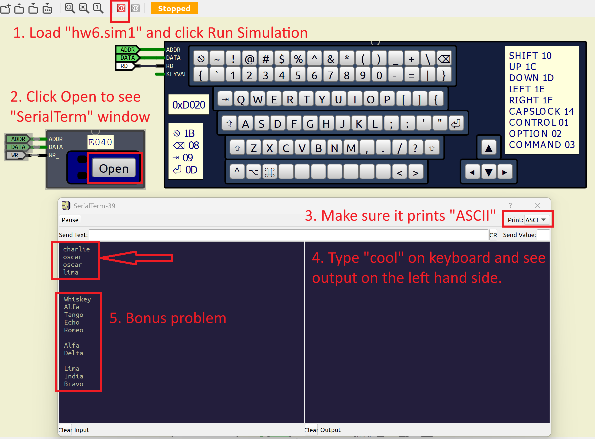

## Practice Problem 1: Fan Controller

You are designing a controller for a cooling fan connected to a memory-mapped I/O port at address `0xEEF0`. The hardware supports both **read and write** operations.

The bit fields for the port are defined as follows:

| bit 7 (MSB) | bit 6 | bit 5 | bit 4 | bit 3 | bit 2 | bit 1 | bit 0 (LSB) |
| :--- | :--- | :--- | :--- | :--- | :--- | :--- | :--- |
| **Fault** | **Mode** | **Speed (High Bit)** | **Speed** | **Speed** | **Speed (Low Bit)** | **Brake** | **Run** |

* **Bit 0: Run** (1 = Spin, 0 = Stop)

* **Bit 1: Brake** (1 = Active, 0 = Inactive)

* **Bits 2-5: Speed** (Value 0-15)

* **Bit 6: Mode** (1 = Turbo, 0 = Eco)

* **Bit 7: Fault** (Read-only: 1 = Error detected)

---

### Task
Write **C99 statements** (not full functions)  to perform the following actions using the pointer `fan_p` defined below:

> `uint8_t *fan_p = (volatile uint8_t * const)0xEEF0U;` 

**Do not alter other bits unless necessary**.

1.  Set the fan to **Run** without changing speed, mode, or brake status.

2.  Set the **Mode** to **Eco** (0).

3.  Set the **Speed** to level **10** (binary `1010`), keeping all other control bits (0, 1, and 6) as they are.

4.  Check if a **Fault** is currently detected. Return the result in:
    `bool is_faulty;` 

---

## Practice Problem 2: Pointer Arithmetic and Dereferencing

  After running the following code:

  ```c
  // Data in memory address 0x4000-0x4007 is at "time 0"
  uint16_t *p1 = ((volatile uint16_t *)0x4000U);
  uint8_t  *p2 = ((volatile uint8_t  *)0x4001U);
  *p1 = 0x1234U;
  *p2 = 0x56U;
  // write "Data @time 1" when code reaches this line

  p1 = p1 + 1;
   p2 = p2 + 1;
  *p1 = 0xABCDU;
  *p2 = 0x78U;
  // write "Data @time 2" when code reaches this line

  p1 = p1 + 2;
   p2 = p2 + 3;
  *p1 = 0x09EFU;
  *p2 = 0x33U;
  // write "Data @time 3" when code reaches this line
  ```

Write the content of memory address from `0x4000` to `0x4007`

| **Address** | Data @time 0 | Data @time 1 | Data @time 2 | Data @time 3 |
|:---:|:---:|:---:|:---:|:---:|
|`0x4000`|`0xAA`||||
|`0x4001`|`0x55`||||
|`0x4002`|`0xCC`||||
|`0x4003`|`0x33`||||
|`0x4004`|`0x11`||||
|`0x4005`|`0x88`||||
|`0x4006`|`0x99`||||
|`0x4007`|`0x66`||||

---

## Practice Problem 3: NATO Phonetic Alphabet

### Part 0: Concept Primer - Strings in C

**Part 0 is already covered in lecture deck 02, page 11: "Strong a long string of symbols."**

Before writing code, it is crucial to understand how C handles "strings". Unlike higher-level languages (like Python), C does not have a native "String" data type.

### 0. NATIO Phonetic Alphabet

If you're interested, read about the [NATO Phonetic Alphabet](https://en.wikipedia.org/wiki/NATO_phonetic_alphabet).

### 1. The NUL Termination
In C, a string is simply a sequence of bytes (characters) in memory, followed immediately by a special "sentinel" value: **0** (or `\0`). This is called the **NUL terminator**.

When you write the string literal `"ABC"` in your code, the compiler stores 4 bytes in memory:

| Offset | Value | Character |
| :--- | :--- | :--- |
| +0 | 0x41 | 'A' |
| +1 | 0x42 | 'B' |
| +2 | 0x43 | 'C' |
| **+3** | **0x00** | **\0 (NUL)** |

Without this zero at the end, functions wouldn't know where the string stops. They would keep reading memory until they crashed the system.

### 2. Arrays of Pointers

In this assignment, we use a "Lookup Table" to convert a letter to a word. We define an array of pointers:

```c
const uint8_t *WORDS[26] = {
    "alfa",    // Index 0 ('A')
    "bravo",   // Index 1 ('B')
    // ...
    "zulu"     // Index 25 ('Z')
};
```

* `WORDS` is an array of 26 addresses.
* `WORDS[0]` holds the *memory address* where the string `"alfa"` begins.
* `WORDS[1]` holds the *memory address* where the string `"bravo"` begins.

To access the string for 'C', you would access `WORDS[2]`.

---

### Part 1: Hardware Specifications

Use pointers to specific memory addresses to talk to the hardware.

#### 1. ASCII Keyboard (`0xD020`)
* **Type:** Read-Only
* **Behavior:** Reading from this address returns the ASCII code of the last key pressed. Reading it also "clears" the hardware buffer, making it ready for the next key.
* **Constraint:** The keyboard only produces capital letters for this assignment.
* **Output:** Bit 7 (MSB) indicates a valid data (a new keypress), while bits 6-0 indicates the ASCII value of the key pressed.

In this assignment, we will focus only on letters `A` - `Z`. Reject all other characters as invalid input.

#### 2. UART Output (`0xE040`)
* **Type:** Write-Only
* **Behavior:** Writing a byte to this address sends that character to the terminal screen. The ASCII code corresponding to the byte data will show up at the UART screen.
* **Status:** Always ready (no need to check status bits).

---

### Part 2: The Assignment

Write a C program that acts as a translator. It must continuously read keys from the keyboard and output the full NATO phonetic word to the UART.

### Requirements:
1.  **Poll the Keyboard:** Continuously check address `0xD020`. If `valid` (bit 7-MSB) is set, then bits 6-0 contain the ASCII code of the key pressed.
2.  **Filter Input:** Process only letters 'A' through 'Z'. Ignore other characters.
3.  **Lookup:** Map the character to the correct string in the `WORDS` array.
    * *Hint: ASCII 'A' is 0x41. Array index 0 is 'A'. How do you convert 65 to 0?*
4.  **Print String:** Iterate through the selected string character-by-character until you hit the NUL terminator. Send each character to the UART (`0xE040`).
5.  **New Line:** After printing the word, print a Carriage Return (CR, ASCII `0x0D` or `\r`) to move to the next line.

### Expected Behavior
If the user types **"COOL"**:

1.  Read 'C' -> Find "charlie" -> Print 'c', 'h', 'a', 'r', 'l', 'i', 'e', CR.
2.  Read 'O' -> Find "omega" -> Print 'o', 'm', 'e', 'g', 'a', CR.
3.  Read 'O' -> Find "omega" -> Print 'o', 'm', 'e', 'g', 'a', CR.
4.  Read 'L' -> Find "lima" -> Print 'l', 'i', 'm', 'a', CR.

Play with `BareMetal-C/sim/hw6.sim1` a bit to see how it works. *Expand* to see the screenshot.

<details>
<summary>Expand to see screenshot:</summary>



</details>

---

### Starter Code

The "Model" for this assignment is trivial. Just focus on the controller (read input) and view (show output).

```c
#include <stdint.h>
#include <stdbool.h>
#include "baremetal_binary.h"

#define KEYBOARD_ADDR ((volatile uint8_t *)0xD020U)
#define UART_ADDR     ((volatile uint8_t *)0xE040U)

// Full NATO phonetic alphabets here:
const char *WORDS[26] = {
    "alfa", "bravo", "charlie", "delta", "echo", "foxtrot",
    "golf", "hotel", "india", "juliett", "kilo", "lima",
    "mike", "november", "oscar", "papa", "quebec", "romeo",
    "sierra", "tango", "uniform", "victor", "whiskey", "xray",
    "yankee", "zulu"
};

void main(void) {
    uint8_t key;
    
    while (true) {
        // 1. Read from Keyboard
        // remember KEYBOARD_ADDR is read-to-clear
        key = *KEYBOARD_ADDR;

        // 2. Check keyboard output valid bit and
        // Check if key is in valid range ('A' through 'Z')
            
            // 3. Calculate Index (0-25)
            uint8_t index = key - 'A';

            // 4. Get the pointer to the start of the string
            const uint8_t *ptr = WORDS[index];

            // 5. Loop until NUL terminator
            // TODO: Write the while loop here to send *ptr to UART_ADDR
            
            // 6. Print CR
            *UART_ADDR = '\r';

        // end if for 2.
    }
}
```

---

### Appendix: Partial ASCII table for relevant characters:

<details>
<summary>Expand to see the ASCII table</summary>

| Hex | Char | | Hex | Char | | Hex | Char |
|:---:|:---:|:---:|:---:|:---:|:---:|:---:|:---:|
| 0x30 | 0 | | 0x4C | L | | 0x67 | g |
| 0x31 | 1 | | 0x4D | M | | 0x68 | h |
| 0x32 | 2 | | 0x4E | N | | 0x69 | i |
| 0x33 | 3 | | 0x4F | O | | 0x6A | j |
| 0x34 | 4 | | 0x50 | P | | 0x6B | k |
| 0x35 | 5 | | 0x51 | Q | | 0x6C | l |
| 0x36 | 6 | | 0x52 | R | | 0x6D | m |
| 0x37 | 7 | | 0x53 | S | | 0x6E | n |
| 0x38 | 8 | | 0x54 | T | | 0x6F | o |
| 0x39 | 9 | | 0x55 | U | | 0x70 | p |
| 0x41 | A | | 0x56 | V | | 0x71 | q |
| 0x42 | B | | 0x57 | W | | 0x72 | r |
| 0x43 | C | | 0x58 | X | | 0x73 | s |
| 0x44 | D | | 0x59 | Y | | 0x74 | t |
| 0x45 | E | | 0x5A | Z | | 0x75 | u |
| 0x46 | F | | 0x61 | a | | 0x76 | v |
| 0x47 | G | | 0x62 | b | | 0x77 | w |
| 0x48 | H | | 0x63 | c | | 0x78 | x |
| 0x49 | I | | 0x64 | d | | 0x79 | y |
| 0x4A | J | | 0x65 | e | | 0x7A | z |
| 0x4B | K | | 0x66 | f | | | |

</details>

---

### Bonus:

1. Print only the first character of the word as Capital, and the rest as lowercase. So, typing: `WATER` produces:

   ```
   Whiskey
   Alfa
   Tango
   Echo
   Romeo
   ```

2. Typing `space` produces a blank line. So, typing: `AD LIB` produces:

   ```
   Alfa
   Delta

   Lima
   India
   Bravo
   ```

---

### Hardware and Deliverables:

- Hardware is in: `BareMetal-C/sim/hw6.sim1`
- Software: start with the skeleton code above and **submit** it as `homework6.c`.
