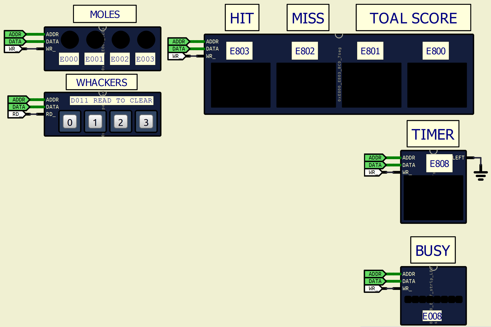
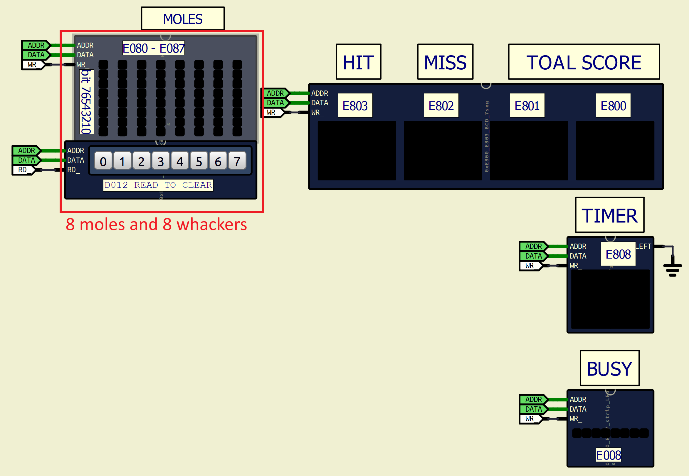

# Homework 7 (In-class session): Whack-a-Mole

## Objective
Implement the **Model** (state logic) and **Controller** (input logic) for a memory-mapped Whack-a-Mole game. The **View** (display logic) and hardware drivers are provided.

*There is a **EXPANSION** to this problem to this as well. Look at section 8.*

## 0. Reference Implementation and code skeleton

`BareMetal-C/sim/hw7.sim1` contains the reference implementation. Play with it. press the button right below the light to "whack-a-mole." Observe **HIT**, **MISS**, **SCORE**, and **TIMER** when you are playing.

`BareMetal-C/code/homeworks/homwork07/hw7_skeleton.c` contains the starter skeleton. You are to fill in this file and submit `hw7.c`.

## 1. Hardware Memory Map

You will interact with the hardware via specific memory addresses.

### Controller (Input)
* **Keypad Register (`0xD011`)**: Read-to-clear.
    * **Bit 7 (MSB)**: `1` if a key is currently pressed (`valid`), `0` otherwise.
    * **Bits 1-0**: The column index of the key pressed (`00` = Col 0, `01` = Col 1, `10` = Col 2, `11` = Col 3).
    * **Bits 6-2**: Unused/Don't Care.

### View (Output)
* **Mole Lights (`0xE000` - `0xE003`)**: Write-only. Write `1` to turn on, `0` to turn off.
    * `0xE000`: Mole 0
    * `0xE001`: Mole 1
    * `0xE002`: Mole 2
    * `0xE003`: Mole 3
* **7-Segment Displays (BCD)**: Write-only.
    * `0xE800`: **SCORE** (16-bit)
    * `0xE803`: **HIT COUNT** (8-bit)
    * `0xE802`: **MISS COUNT** (8-bit)
    * `0xE808`: **TIMER** (8-bit)

---

## 2. Game Logic & Constants

You must implement the game rules using the following constants:

| Constant | Value | Description |
| :--- | :--- | :--- |
| `MAX_TIMER` | `28` | The countdown start value for every new turn. |
| `MISS_PENALTY` | `5` | Points deducted for a miss or timeout. |
| `MAX_SCORE` | `299` | Score saturation limit. |
| `MAX_HIT_COUNT` | `99` | Hit count saturation limit. |
| `MAX_MISS_COUNT`| `99` | Miss count saturation limit. |

### State Update Rules (`model_update`)

The system generates an interrupt to call your update function. The input `c` will be `NONE` (no input, time passes) or a specific whack command (`WHACK0`..`WHACK3`).

1.  **If Input is `NONE` (Timer Tick):**
    * If `timer` reaches 0 (Timeout):
        * **Score:** Decrease by `MISS_PENALTY` (floor at 0).
        * **Miss Count:** Increase by 1 (saturate at `MAX_MISS_COUNT`).
        * **Reset:** Reset `timer` to `MAX_TIMER`. Move mole to a new random position.
    * If `timer` > 0:
        * Decrement `timer` by 1.
        * Update internal random state (churn the RNG).

2.  **If Input is `WHACKx` (Player Action):**
    * **Correct Whack:** (Input matches `mole_position`)
        * **Score:** Increase by current `timer` value (saturate at `MAX_SCORE`).
        * **Hit Count:** Increase by 1 (saturate at `MAX_HIT_COUNT`).
        * **Reset:** Reset `timer` to `MAX_TIMER`. Move mole to a new random position (inject entropy).
    * **Wrong Whack:** (Input does *not* match `mole_position`)
        * **Score:** Decrease by `MISS_PENALTY` (floor at 0).
        * **Miss Count:** Increase by 1 (saturate at `MAX_MISS_COUNT`).
        * **Penalty:** Decrement `timer` by 1 (time penalty).
        * **RNG:** Update internal random state (inject entropy).

---

## 3. Entropy & Randomness

The provided helper `random_8bit(seed)` is a deterministic pseudo-random number generator (PRNG). If we always passed the previous number as the seed, the game would be identical every time.

To achieve true unpredictability, we use **User Timing Entropy**:

  `mp->random = random_8bit(mp->random + mp->timer);`

**Explanation:**
The `timer` variable represents the remaining time when a user reacts. Because human reaction time varies by milliseconds (and thus the exact cycle count where the interrupt is handled varies), the value of `mp->timer` at the moment of a button press is unpredictable. Adding this unpredictable user value to our seed "jumps" the PRNG sequence to a new, random track, preventing the player from memorizing the pattern.

---

## 4. Assignment Requirements

Implement the following three functions in `whack_mole.c`.

### 1. `command controller_read(void)`
* Reads the Keypad register `0xD011`.
* Checks the Valid Bit (Bit 7).
* If invalid, returns `NONE`.
* If valid, masks the column bits (0-1) and returns the corresponding command (`WHACK0`, `WHACK1`, `WHACK2`, or `WHACK3`).

### 2. `void model_init(model_t *mp)`
* Initializes the model structure.
* Seed `random` with `123`.
* Set initial `mole_position` using `random_2bit`.
* Set `timer` to `MAX_TIMER`.
* Zero out `hit_count`, `miss_count`, and `score`.

### 3. `void model_update(model_t *mp, command c)`
* Implement the **State Update Rules** described in Section 2.
* Utilize `random_8bit` and `random_2bit` helpers provided in the file.

#### Struct Reference
```c
typedef struct {
    uint8_t mole_position; // Current active mole (0-3)
    uint8_t timer;         // Countdown timer for current turn
    uint8_t hit_count;     // Total hits
    uint8_t miss_count;    // Total misses
    uint16_t score;        // Current score
    uint8_t random;        // Current RNG state
} model_t;
```

## 5. Corner cases

- Make sure you model's `score` display never exceeds `MAX_SCORE`. If you do, **TOTAL SCORE** will show `EEEE`, indicating error.
- Make sure that your model's `hit_count` and `miss_count` never exceed their respective maximum values, or **HIT** and **MISS** will show `EE`, indicating failure in clamping saturation value.
- Slow down simulation time to see that your `nmi_handler` is running quickly enough. I have optimized `view_update` for you, so this wil make your life easier.

## 6. Bonus Questions:

1. Reference: slide 03-09: Why did I use *manual* `enum` for *model-controller* message?

   ```c
   // MODEL-CONTROLLER message
   typedef enum {
       WHACK0 = 0,
       WHACK1 = 1,
       WHACK2 = 2,
       WHACK3 = 3,
       NONE = 4
   } command;
   ```

2. In `view_update`, there's a line of code:

   ```c
   static uint8_t previous_mole_position = 5; // can be dangerous here! can you explain why?
   ```

   When can this line be "dangerous?" and how dangerous can it be?

3. Explain how `bcd_uint8` work.
4. Explain how `bcd_uint16` work.

## 7. Hardware View

<details>

<summary>Click to see hw7 hardware</summary>

  

</details>

## 8. Bonus Problem: 8-Mole Expansion Pack

In this bonus challenge, we will upgrade the hardware to support **8 Moles** and **8 Whackers**. Additionally, instead of a simple ON/OFF light, each mole hole is now equipped with an **8-bit vertical LED strip**.

This LED strip simulates the mole's depth. When a mole first appears, it is fully visible (all LEDs on). As the timer ticks down, the mole "recedes" back into the hole (fewer LEDs on) until it disappears completely.

### 0. Play with the reference implementation

Load up `BareMetal-C/sim/hw7x.sim1` to play.

### 1. Extended Hardware Map

#### Controller (Input)
* **Extended Keypad Register (`0xD012`)**: Read-to-clear.
    * **Bit 7 (MSB)**: `1` if a key is currently pressed (`valid`), `0` otherwise.
    * **Bits 2-0**: The column index of the key pressed (`000`=Col 0 ... `111`=Col 7).
    * **Bits 6-3**: Unused/Don't Care.

#### View (Output)
* **Mole LED Strips (`0xE080` - `0xE087`)**: Write-only.
    * **Address Mapping**:
        * `0xE080`: Mole 0
        * `...`
        * `0xE087`: Mole 7
    * **Bit Mapping**: Each address controls a vertical bar of 8 lights.
        * **MSB (Bit 7)**: Topmost light.
        * **LSB (Bit 0)**: Bottommost light.

### 2. Visual Logic: The Receding Mole

The LED strip must reflect the remaining time for the current mole. You must map the `timer` value to a bar-graph display pattern as follows:

| Timer Value | Visible Lights (Bottom-up) | Binary Pattern | Hex |
| :--- | :--- | :--- | :--- |
| `> 15` | 8 lights (Full) | `0b11111111` | `0xFF` |
| `13 - 14` | 7 lights | `0b01111111` | `0x7F` |
| `11 - 12` | 6 lights | `0b00111111` | `0x3F` |
| `9 - 10` | 5 lights | `0b00011111` | `0x1F` |
| `7 - 8` | 4 lights | `0b00001111` | `0x0F` |
| `5 - 6` | 3 lights | `0b00000111` | `0x07` |
| `3 - 4` | 2 lights | `0b00000011` | `0x03` |
| `1 - 2` | 1 light | `0b00000001` | `0x01` |
| `0` | 0 lights (Gone) | `0b00000000` | `0x00` |

### 3. Summary of Changes

To complete this bonus:

1.  **Reference Hardware**: `BareMetal-C/sim/hw7x.sim1`

2.  **Starter Skeleton**: `BareMetal-C/code/homeworks/homework07x/hw7x_skeleton.c`.
    - `random_2bit` function has been changed to `random_3bit`.

3.  **Things to update**:
    - `command enum`
    - `command controller_read(void)`
    - `void model_init(model_t *mp)`
    - `void model_update(model_t *mp, command c)`
    - `void view_update(const model_t *mp)`

### 4. Reference hardware view

<details>

<summary>Click to see hw7x hardware</summary>

  

</details>
